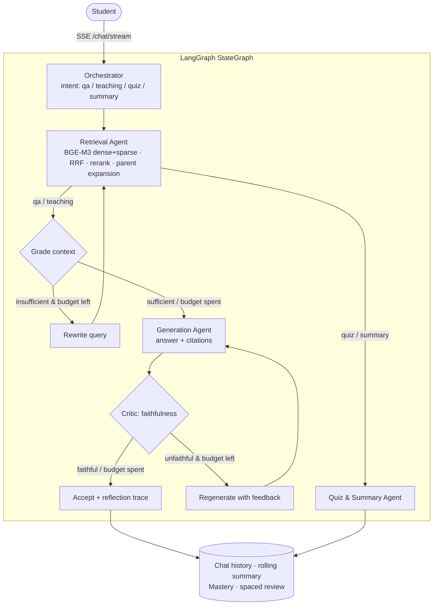

# 🎓 StudyRAG — Multi-Agent RAG Study Assistant

> Ask questions about **your own lecture slides and textbooks** and get answers that are
> **grounded, cited and self-checked** — then turn the same material into quizzes that track
> what you actually remember.

[](https://github.com/VinhDoan1604/StuQuiz/actions/workflows/ci.yml)


🇻🇳 Bản tiếng Việt: [README.vi.md](README.vi.md)

<!-- TODO(Vinh): replace with a real GIF (upload → ask → reflection timeline → citation click → quiz).
     Record with ScreenToGif / OBS, keep it < 10 MB, save as assets/demo.gif, then uncomment:
<p align="center"></p>
-->


---

## Why this project

Students learn from long, messy, often Vietnamese PDFs and slide decks. A plain "chat with your PDF"
bot has three problems on this kind of material:

1. **It answers confidently when the context is wrong or missing** (hallucination).
2. **You can't verify it** — no pointer back to the slide or page.
3. **It doesn't help you remember** — every session starts from zero.

StudyRAG addresses each one explicitly: a **Corrective-RAG + Self-RAG reflection loop** grades the
retrieved context *before* generation and the answer's faithfulness *after* it; every answer carries
**clickable citations** to the source chunk; and a **server-graded quiz + spaced-review tracker**
keeps a per-topic mastery score.

## Key features

| | |
|---|---|
| 🔁 **Reflection loop (CRAG + Self-RAG)** | Grade context → rewrite query & re-retrieve if insufficient → generate → critic checks faithfulness → regenerate with feedback. Bounded by `MAX_REFLECTION_LOOPS`; forced acceptances are flagged in the trace, not hidden. |
| 🔎 **Hybrid retrieval** | BGE-M3 dense (1024-d) + learned sparse vectors in one Qdrant collection, fused with RRF, then `bge-reranker-v2-m3` cross-encoder, then child→parent chunk expansion. |
| 🧭 **Intent routing** | Orchestrator classifies `qa / teaching / quiz / summary`; teaching mode explains step by step instead of just answering. |
| 📡 **Live reasoning trace** | `/chat/stream` (SSE) streams each graph step; the React UI renders it as a timeline with context/answer scores and rewritten queries. |
| 🧠 **Memory** | Token-budgeted context window + rolling summary (summarised in the background after the response) + weak-topic injection from mastery records. |
| 📝 **Quiz & mastery** | Answers never leave the server before grading; mastery score (asymmetric +10 / −15) and a Leitner-style review schedule (1 → 3 → 7 → 14 days). |
| 💸 **Cost-aware LLM routing** | Cheap model for rewrite/decompose/grade/qa, strong model for teaching/quiz/summary; provider-agnostic (Gemini, OpenAI, Anthropic). Token usage tracked per task via callbacks. |
| 🇻🇳 **Vietnamese-ready ingestion** | PDF (PyMuPDF → pypdf fallback → Tesseract `vie` OCR for scans), DOCX, PPTX, TXT, MD; Unicode NFC normalisation; heading-aware semantic chunking. |

## Architecture


```mermaid
flowchart TD
    User([Student]) -->|SSE /chat/stream| Orchestrator[Orchestrator<br/>intent: qa / teaching / quiz / summary]

    subgraph "LangGraph StateGraph"
        Orchestrator --> Retrieval[Retrieval Agent<br/>BGE-M3 dense+sparse · RRF · rerank · parent expansion]
        Retrieval -->|qa / teaching| GradeContext{Grade context}
        Retrieval -->|quiz / summary| QuizSummary[Quiz & Summary Agent]

        GradeContext -->|insufficient & budget left| RewriteQuery[Rewrite query]
        RewriteQuery --> Retrieval
        GradeContext -->|sufficient / budget spent| Generation[Generation Agent<br/>answer + citations]

        Generation --> GradeAnswer{Critic: faithfulness}
        GradeAnswer -->|unfaithful & budget left| RetryGen[Regenerate with feedback]
        RetryGen --> Generation
        GradeAnswer -->|faithful / budget spent| Accept[Accept + reflection trace]
    end

    Accept --> Memory[(Chat history · rolling summary<br/>Mastery · spaced review)]
    QuizSummary --> Memory
```

**Ingestion path:** upload → parse (OCR fallback) → clean/NFC → parent/child semantic chunks
(child 200–400 tokens, 50 overlap; parent ≤ 1 500) → BGE-M3 dense + sparse → Qdrant, filtered by `doc_id`.

| Layer | Tech |
| :--- | :--- |
| API | FastAPI, SSE, JWT (HS256), argon2id, Google Sign-In, email OTP, Redis-backed rate limiting |
| Orchestration | LangGraph `StateGraph` ([`app/graph/build_graph.py`](app/graph/build_graph.py)), LangChain Core |
| Models | Gemini / OpenAI / Anthropic via [`app/llm/router.py`](app/llm/router.py); BGE-M3; bge-reranker-v2-m3 |
| Storage | PostgreSQL 16 + Alembic migrations; Qdrant |
| Frontend | React 19 + Vite + TypeScript, served by nginx |
| Ops | Docker Compose (postgres · qdrant · redis · api · web), GitHub Actions CI, `/health` + `/ready`, JSON logs with `X-Request-ID` |

## Design decisions & trade-offs

- **Why a reflection loop instead of naive RAG?** Course material is dense and terminology-heavy;
  the first retrieval is often near-miss. Grading context *before* generating is cheaper than
  generating and then failing the critic. The loop is capped, and the trace records whether a
  grade was actually computed (`*_verified`) or the answer was accepted because the budget ran out
  (`*_forced`) — so the UI never claims a check that didn't happen.
- **Why BGE-M3 sparse instead of BM25/Elasticsearch?** One model produces both dense and lexical
  vectors, so hybrid search lives in a single Qdrant collection with no extra search engine to run.
  It is also multilingual, which matters for Vietnamese + English mixed slides.
- **Why parent/child chunks?** Small child chunks retrieve precisely; the parent section is what
  the LLM reads, so answers don't lose surrounding definitions.
- **Why a cheap/strong router?** Grading and rewriting are short classification-style calls that run
  several times per question; routing them to a cheaper model keeps the loop affordable.
- **Known cost:** the full loop makes more LLM calls and adds latency vs. single-shot RAG. The
  evaluation below is designed to measure whether that cost buys accuracy.

## Evaluation

An ablation harness ([`eval/`](eval/README.md)) adds one component at a time so each gain is attributable:

| Config | Adds |
|---|---|
| `dense` | Naive RAG baseline: dense top-5 → single generation |
| `hybrid` | + sparse vectors, RRF fusion |
| `hybrid_rerank` | + cross-encoder rerank (top-20 → top-5) |
| `parent` | + child → parent expansion (context up to 1,500 tokens) |
| `crag` | + context grading & query rewriting |
| `full` | + faithfulness critic & regeneration |

Metrics: retrieval **hit@k / recall@k / MRR**; answer **correctness & faithfulness** (LLM-as-judge
using a *different* model from the generator); **correct refusal rate** on unanswerable questions;
latency and LLM calls per question. All numbers come with **95 % bootstrap CIs** and paired-bootstrap
differences, and judge reliability is audited against human labels (`eval/audit.py`: 85 % agreement,
17/20 — see Limitations).

### Results

**Setup:** 18 public documents ([`eval/CORPUS.md`](eval/CORPUS.md): Vietnamese Wikipedia, OpenStax, a
Vietnamese decree, VOER, course notes/slides), **48 reviewed questions** (37 answerable, 11 unanswerable;
11 in English against Vietnamese sources). Generator `gemini-2.5-flash`, judge `gpt-5.4` (different
vendor). BGE-M3, top-k = 5. Brackets are 95 % bootstrap CIs.
Full reports: [`full-v1`](eval/results/full-v1/report.md) (all configs, with LLM) and
[`retrieval-v2`](eval/results/retrieval-v2/report.md) (retrieval re-scored for free after fixing the
label of q064 — see Limitations).

**Retrieval** (answerable questions, n = 37, scored on child chunks — `retrieval-v2`)

| Config | hit@1 | hit@5 | recall@5 | MRR |
|---|---|---|---|---|
| `dense` | 0.54 [0.38–0.70] | 0.97 [0.92–1.00] | 0.92 [0.84–0.97] | 0.71 [0.60–0.82] |
| `hybrid` | 0.57 [0.41–0.73] | 0.89 [0.78–0.97] | 0.86 [0.74–0.96] | 0.69 [0.57–0.81] |
| `hybrid_rerank` | **0.78** [0.65–0.92] | **1.00** [1.00–1.00] | **0.95** [0.89–0.99] | **0.88** [0.81–0.95] |

`parent` and `crag` rank chunks exactly like `hybrid_rerank` (they change what happens after
retrieval); `full` was within 0.03 on every metric in `full-v1`.

**Answers** (`full-v1`; faithfulness & correctness on n = 37 answerable, refusal on n = 11 unanswerable)

| Config | Faithfulness | Correctness | False refusal ↓ | Correct refusal | p50 latency | LLM calls |
|---|---|---|---|---|---|---|
| `dense` | **0.92** [0.88–0.95] | 0.96 [0.91–1.00] | 0.03 | 11/11 | 5.2 s | 1.0 |
| `hybrid` | 0.91 [0.87–0.95] | 0.95 [0.87–1.00] | 0.05 | 11/11 | 5.4 s | 1.0 |
| `hybrid_rerank` | 0.89 [0.86–0.93] | 0.95 [0.89–0.99] | 0.05 | 11/11 | 42.8 s | 1.0 |
| `parent` | 0.91 [0.87–0.94] | 0.97 [0.93–1.00] | 0.03 | 11/11 | 41.7 s | 1.0 |
| `crag` | 0.89 [0.85–0.93] | 0.97 [0.93–1.00] | 0.00 | 11/11 | 49.0 s | 2.9 |
| `full` | 0.87 [0.83–0.92] | **0.99** [0.96–1.00] | 0.00 | 11/11 | 50.3 s | 4.1 |

**What the numbers say**

- **The reranker is the only component with a statistically clear gain:** MRR +0.17 [+0.09, +0.26]
  and hit@1 0.54 → 0.78 over `dense` (paired bootstrap). It is also the main latency cost (CPU,
  ~35 s/question). Example (q025, "what do the white/grey/black vertex colours mean in Dijkstra?"):
  with `dense` the evidence was the 5th, LaTeX-cluttered chunk and the model opened with "the
  documents don't say" — then listed all three meanings from that same chunk; with `hybrid` the
  evidence was not retrieved at all and the model (honestly) refused. Once the reranker moved the
  evidence to position 1, every config answered correctly.
- **Hybrid (sparse + RRF) did not help** on this corpus: hit@5 −0.08 [−0.19, 0.00], MRR −0.02
  [−0.08, +0.05] vs. `dense`. It is kept only as the candidate generator for the reranker.
- **CRAG / the full loop** raise correctness (0.96 → 0.99) and remove false refusals (3 % → 0 %), but
  neither difference is significant at n = 37 — while costing ~4× the LLM calls and ~10× the latency of
  `dense`.
- **Faithfulness drops slightly** as components are added (0.92 `dense` → 0.87 `full`, Δ −0.04
  [−0.10, +0.01]) — not significant, but the opposite of what the critic loop is meant to do. Not yet
  diagnosed; longer parent contexts and multi-source synthesis are the first suspects.
- **Correct refusal is 11/11 for every config** — the unanswerable set is too easy to discriminate
  between configs (ceiling effect).

## Security & data isolation

- Every route except login requires a JWT; identity always comes from the token, never the body.
- Every client-supplied id (space, document, session) is ownership-checked in
  [`app/core/ownership.py`](app/core/ownership.py); other users' resources return **404**.
- Vector search **requires** a verified `doc_id` list — no collection-wide queries.
- Quiz answers are never sent to the client before server-side grading.
- OTPs are stored as HMAC, with attempt limits, expiry and resend cooldown.

## Quick start (Docker)

```bash
git clone https://github.com/VinhDoan1604/StuQuiz.git && cd StuQuiz
cp .env.example .env      # set POSTGRES_PASSWORD and one LLM key (e.g. GOOGLE_API_KEY)
docker compose up -d --build
```

Open **http://localhost:8080**. Migrations run on start. On first ingestion BGE-M3 and the reranker
(~2–3 GB) are downloaded into the `model_cache` volume (`PRELOAD_MODELS=true` to download at boot).

<details>
<summary>Local development</summary>

Requires Python 3.11, Node 20+, Docker (for Postgres/Qdrant). Optional: `tesseract-ocr` + `tesseract-ocr-vie`.

```bash
docker compose up -d postgres qdrant
python -m venv .venv && source .venv/bin/activate      # Windows: .venv\Scripts\activate
pip install -r requirements-dev.txt
python scripts/init_db.py                              # alembic upgrade head
python scripts/seed_demo.py                            # optional demo data
uvicorn app.main:app --reload --port 8000              # Swagger at /docs (APP_ENV=dev only)
cd frontend && npm install && npm run dev              # http://localhost:5173
```

- With `APP_ENV=dev`, if Postgres is unreachable the backend falls back to SQLite; other envs fail fast.
- In dev without SMTP, the OTP is shown on the verification screen.
- Optional tracing: set `LANGSMITH_TRACING=true` + `LANGSMITH_API_KEY` to see every graph run in LangSmith.
- Google Sign-In setup: see [README.vi.md](README.vi.md#bật-đăng-nhập-google-tuỳ-chọn).

</details>

## Tests & quality

```bash
pytest -q                                  # 107 tests: API, auth isolation, graph routing, memory, quiz, rate limit — no LLM/Qdrant needed
ruff check app tests migrations scripts
cd frontend && npm run lint && npm run build
```

CI runs lint, an Alembic upgrade/downgrade round-trip, pytest, and the frontend build on every push.

## Project layout

```
app/
├── api/         routes: auth, spaces, documents, chat (SSE), quiz, mastery
├── agents/      orchestrator, retrieval, generation, reflection, quiz/summary
├── graph/       LangGraph StateGraph + run/stream
├── retrieval/   query rewrite/decompose, rerank, parent expansion
├── ingestion/   parsers, OCR, cleaning        chunking/  semantic + fixed baseline
├── embedding/   BGE-M3                        indexing/  Qdrant store
├── memory/      chat history, context window, mastery tracker
├── llm/         provider registry + cheap/strong router
└── core/        security, ownership, rate limit, logging
eval/            ablation harness, judge, bootstrap metrics, judge audit
frontend/        React + Vite (Dockerfile + nginx)
migrations/      Alembic          tests/  pytest
```

## Limitations & next steps

- **Small eval set → wide CIs.** Only 37 answerable questions; most differences between configs fall
  inside the 95 % CI, so only the reranker's gain is claimed as real.
- **The judge agrees with a human on 85 % of answers (17/20)** (`eval/audit.py`, random sample from
  `full-v1`, exact correct/partial/incorrect label). All 3 disagreements were the judge being **more
  lenient** (correct vs. partial ×2 on the same question, partial vs. incorrect ×1); it was never
  stricter. Mean correctness on the sample: judge 0.95 vs. human 0.875, so absolute correctness above
  is likely somewhat optimistic; comparisons between configs are less affected because the same judge
  grades all of them. One grader, 20 answers (16 distinct questions, 18/20 judged correct) — a small
  check, not a calibration. Faithfulness was not audited.
- **One label was fixed after the run (q064).** Its gold evidence sat in a pseudo-code chunk that no
  config retrieves, while a neighbouring chunk states the answer directly. An alternative evidence was
  added and retrieval re-scored (`retrieval-v2`, no LLM calls); answer metrics are from `full-v1`.
- **False refusals are slightly under-counted.** The judge flags `abstained` only when an answer
  *mostly* says the information is missing, so a self-contradictory answer that claims "not in the
  documents" and then answers anyway (q025 with `dense`) is not counted as a refusal. A cheap fix —
  flag answers that both claim missing information and cite sources, then regenerate — is planned
  but not yet measured.
- **Correct-refusal rate is at the ceiling** (11/11 everywhere): the unanswerable questions need
  harder near-miss cases to separate configs.
- **`hybrid` is not fully deterministic:** Qdrant's RRF produces score ties at the top-5 cut-off and
  breaks them arbitrarily, so `hybrid` numbers move slightly between runs (`hybrid_rerank` is stable
  because it reranks the top 20).
- Auto-generated eval questions share vocabulary with the source, which makes retrieval look easier
  than real student questions; the dataset is being extended with hand-written paraphrases.
- Indexing runs in-process; a task queue would be needed for many concurrent uploads.
- One worker per container because models live in process memory; scale out horizontally.

See [ROADMAP.md](ROADMAP.md) for what's done and what's next.

## Author

**Đoàn Công Vinh** — Computer Science, Ho Chi Minh City University of Technology (HCMUT) ·
[GitHub](https://github.com/VinhDoan1604) <!-- TODO(Vinh): add LinkedIn / email -->

<!-- TODO(Vinh): choose a license (e.g. MIT) and add LICENSE; until then all rights reserved. -->
